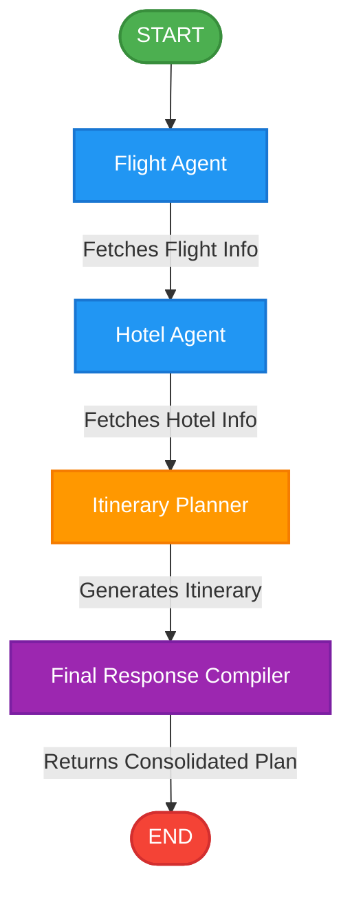

# TripMate AI - A Multi-Agent Travel Planner with LangGraph

TripMate AI is an intelligent travel planning application that leverages a multi-agent system built with LangGraph, LangChain, and FastAPI. It automates the process of fetching flight details, finding hotels, and generating a complete, day-by-day travel itinerary for users.

## Features
- **Multi-Agent Architecture**: Built with LangGraph, separating concerns into discrete nodes (Flight Agent, Hotel Agent, Itinerary Generator, and Final Response Compiler).
- **FastAPI Backend & Frontend**: Serves a seamless REST API along with a web interface.
- **LLM Integration**: Uses Groq API for lightning-fast and intelligent itinerary generation.
- **State Checkpointing**: Employs Postgres Checkpointing (`langgraph.checkpoint.postgres`) to preserve thread state and memory across interactions.
- **Tool Integration**: Uses Tavily and custom tools for retrieving flight and hotel information.

## System Architecture

The following diagram illustrates the flow of the multi-agent system orchestrated by LangGraph:



## Setup & Installation

1. **Clone the repository**:
   ```bash
   git clone <repo-url>
   ```

2. **Install dependencies**:
   Make sure you have Python 3.10+ installed.
   ```bash
   pip install -r requirements.txt
   ```

3. **Environment Variables**:
   Update the `.env` file in the root directory and configure the following variables:
   ```ini
   GROQ_API_KEY=your_groq_api_key
   DATABASE_URL=your_postgres_connection_string
   TAVILY_API_KEY=your_tavily_api_key
   ```

4. **Run the Application**:
   You can run the FastAPI web interface:
   ```bash
   python app.py
   ```
   Or use the CLI application:
   ```bash
   python main.py
   ```

## Application Screenshot


## License
This project is licensed under the terms described in the [LICENSE](LICENSE) file.